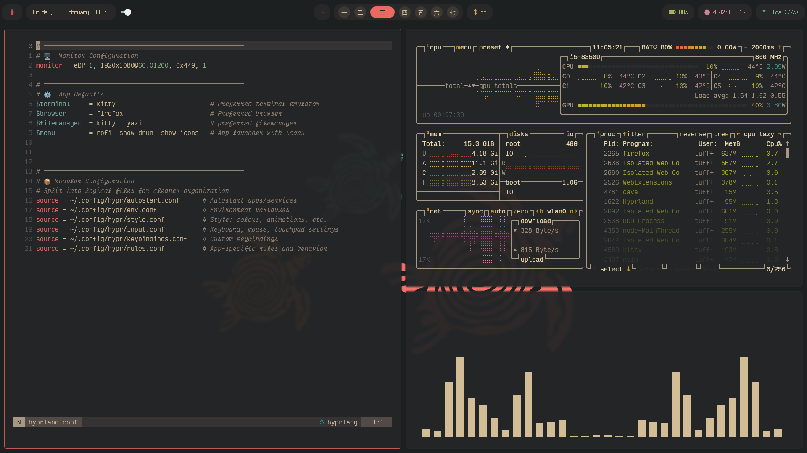

# Hyprland Configuration

## Summary

This repository contains my personal Hyprland configuration, designed for a highly productive, keyboard-driven workflow with a clean, modern aesthetic inspired by Gruvbox and Nord themes.

## Goals & Philosophy

My Hyprland setup is built around several core principles:

*   **Productivity First:** Optimize for speed and efficiency with a strong emphasis on keyboard navigation and quick application access.
*   **Organized Workspace:** Utilize dedicated and special workspaces to logically separate applications and tasks, reducing visual clutter and improving focus.
*   **Visual Cohesion:** Achieve a clean, modern, and aesthetically pleasing desktop experience with consistent theming and subtle visual effects.
*   **Customization & Control:** Tailor every aspect of the window manager, from keybindings to visual elements, to suit personal preferences and enhance user experience.

## Aesthetics & Theming

The visual design emphasizes a blend of functional clarity and modern elegance:

*   **Color Scheme:** A Gruvbox-inspired palette forms the foundation, visible in wallpapers, lock screen elements, and input fields.Active window borders use a reddish-orange Gruvbox accent for clear identification.
*   **Visual Effects:**
    *   **Rounded Corners:** Windows feature subtle 5px rounded corners for a softer, contemporary look.
    *   **Blur with Vibrancy:** Transparent elements (like the lock screen) utilize a blur effect with a touch of vibrancy, creating a sophisticated "frosted glass" appearance.
    *   **Smooth Animations:** Custom bezier curves ensure fluid and pleasing transitions for windows and workspaces.
*   **Typography:** Custom fonts are used for a personalized touch, such as Chango and Quicksand for the lock screen clock/date, and VictorMono Nerd Font for input fields.
*   **Minimalist Touches:** Default Hyprland branding (logo, wallpaper) is disabled, allowing for a fully customized visual environment. Gaps between windows and around the screen edge are carefully set for balance.

## Use my Configs

Feel free to fork it. Please note that this configuration is a work in progress and may not be fully polished. 
