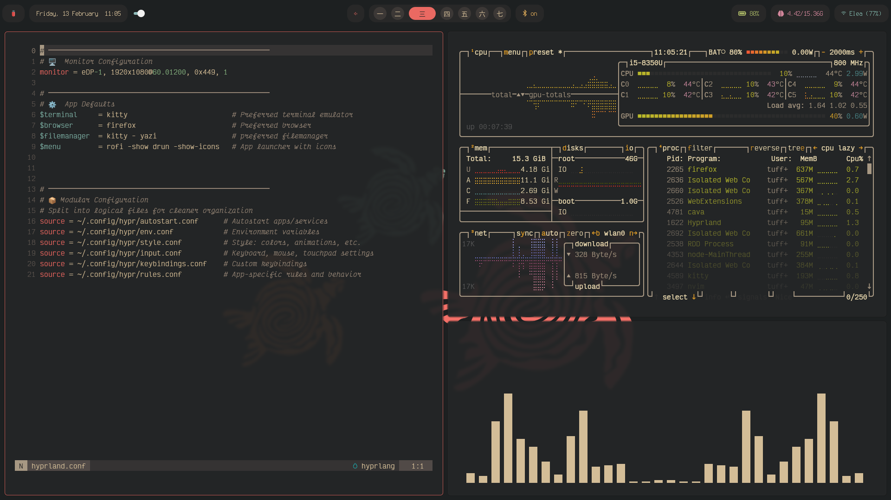

<div align="center">


# CHADLAND (Hyprland Config)

**Welcome to the blazingly fast, keyboard-centric, absolute gigachad Hyprland configuration.**

</div>

Look, if you're out here clicking around with a mouse like it's 2005, we have a problem. This config is built for speed, efficiency, and a workflow so smooth it'll make you want to rewrite your entire life in Rust (btw).

We are talking full Vim motions, dedicated scratchpads, Ghostty terminal, and a visual aesthetic that is just... *chef's kiss*. Let's gooooo!



## 🚀 The Philosophy

1.  **Vim Motions Everywhere:** If my hands leave the home row, something went terribly wrong. `h j k l` is the only way to navigate.
2.  **Blazingly Fast Apps:** We use **Ghostty** because it's fast. We use **Yazi** because it's fast. We don't wait for things to render.
3.  **Special Workspaces:** Stop cluttering your main views. Throw your notes, scratchpads, and background apps into `slot1`, `slot2`, or `slot3`. Out of sight, but one keystroke away.
4.  **Aesthetics:** Gruvbox, Nord, Rozejin... we have themes that actually look good. No more default anime mascots.

## 🛠️ The Stack (You need this)

*   **Terminal:** [Ghostty](https://ghostty.org/) (The only correct answer)
*   **File Manager:** [Yazi](https://github.com/sxyazi/yazi) (Blazingly fast terminal file manager)
*   **Launcher / Clipboard:** Rofi + cliphist
*   **Browser:** Firefox (with Vimium, obviously)

## ⌨️ Keybindings (The Chad Way)

Your `Super` / `Mod` key is your new best friend.

| Action | Keybinding |
| :--- | :--- |
| **Launch Ghostty** | `Super + Enter` |
| **Launch Yazi** | `Super + E` |
| **App Launcher (Rofi)** | `Super + R` |
| **Clipboard History** | `Super + V` |
| **Kill Window** | `Super + Shift + C` |
| **Vim Focus Move** | `Super + h/j/k/l` |
| **Vim Window Move** | `Super + Shift + h/j/k/l` |
| **Toggle Floating** | `Super + Shift + Space` (Auto-centers and resizes!) |
| **Special Scratchpads** | `Super + S` (Slot 1), `Super + A` (Slot 2), `Super + D` (Slot 3) |
| **Screenshot (Save & Copy)** | `Super + Shift + P` (Select area) or `Super + P` (Full screen) |

## 🎨 Theming (Look Good, Code Better)

We don't just use one theme and cry when we get bored. We have a dynamic theming system.

**Available Themes:** `gruvbox`, `nord`, `rozejin`

### How to apply a theme:

Just run the provided scripts. It copies the config, reloads Hyprland, and restarts your wallpaper.

```bash
# Apply just to Hyprland
./scripts/apply-hypr-theme.sh rozejin

# Apply to Hyprland AND Waybar (if you have matching Waybar themes)
./scripts/apply-desktop-theme.sh gruvbox
```

### Make it Global:

Want to switch themes from anywhere without typing paths like a peasant? Install the global commands:

```bash
./scripts/install-hypr-theme-command.sh
./scripts/install-desktop-theme-command.sh

# Now you can just do this from anywhere:
hypr-theme nord
apply-desktop-theme gruvbox
```

### Create Your Own:

1. Copy `themes/gruvbox` to `themes/<your-theme-name>`.
2. Edit `style.conf`, `hyprlock.conf`, and `hyprpaper.conf` in that folder.
3. Apply it: `hypr-theme <your-theme-name>`.

## 🤝 Use my Configs

Fork it. Clone it. Steal it. Just don't blame me if you become too productive and your boss expects 10x the output. 

*If you find a bug, fix it and send a PR. Or just complain on the internet. Your call.*